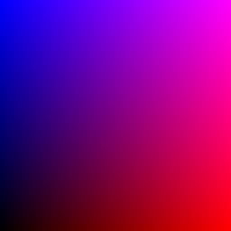
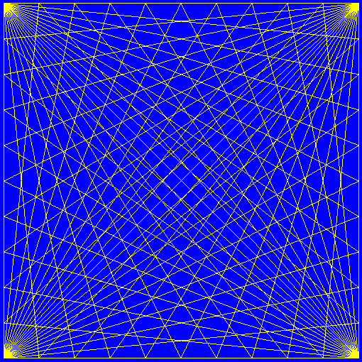
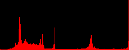
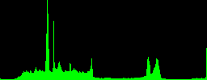
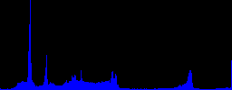
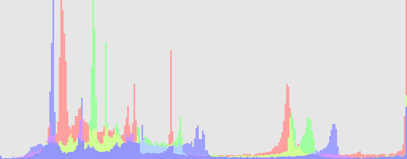

# tlibmp - tiny libbmp

[](http://opensource.org/licenses/MIT)


A tiny libary that can read/write/edit .BMP files from disk

[View on Github](https://github.com/yeonzi/tlibmp)

## Basic

It was a lib that can create bmp file, and print in it.

these is some demo with this lib:

### Color print


### Draw lines


## Image processing

it also contain some basic	image processing functions.

To show this, I use a picture from pixiv by
[(ˉ﹃ˉ)EM1234](https://www.pixiv.net/member.php?id=8467971) as following:

[](https://www.pixiv.net/member_illust.php?mode=medium&amp;illust_id=61057871)

I have transform it to a bmp file named test.bmp,

Use this lib, I have made the following images:

### Gray


### Binary


### Color inverse


### Histogram graph









### Mosaic


## Data Format

there are only one format for the bitmap:

```c
/* tlibmp bitmap struct */
typedef struct {
    uint32_t width;
    uint32_t height;
    uint8_t  *data;  /* Data format: [RGBA] */
}tlb_image_t;
```

as the content of the struct may change later, you should **never** call the element directly.

## APIs

### Summary
```c
/* BMP operation APIs */

/* load a bmp frome file */
tlb_image_t * tlb_load_bmp(const char *file_name);

/* save bmp to file by default settings */
int tlb_save_bmp(const char *file_name, tlb_image_t * image);

/* print basic info of a bmp file */
int tlb_print_bmp_info(const char *file_name);

/* Image operation APIs */

/* new image */
tlb_image_t * tlb_img_new(uint32_t width, uint32_t height, uint32_t bgcolor);

/* free image struct */
void tlb_img_free(tlb_image_t * image);

/* make a copy of a image */
tlb_image_t * tlb_img_copy(tlb_image_t * image);

/* inverse the color of the image */
int tlb_img_inverse(tlb_image_t * image);

/* trans the image to gray scale graph */
int tlb_img_gray(tlb_image_t * image);

/* binary this graph with threshold */
int tlb_img_binary(tlb_image_t * image, uint8_t threshold);

/* create a histogram of a channel */
tlb_image_t * tlb_img_ch_histogram(tlb_image_t * image, uint8_t channel);

/* create a histogram graph of all visible channel */
tlb_image_t * tlb_img_histogram(tlb_image_t * image);
```

### Detail

#### tlb\_image\_t * tlb\_load\_bmp(const char *file\_name);

##### Entry parameters：
`const char *file_name` : the path of the file to load, just like fopen. ( In fact, it was passed directly to fopen(3) )

##### Return：
This fucntion will return a pointer to a struct with image loaded.

##### Usage reference:
```c
/* a NULL pointer of the object */
tlb_image_t * image = NULL;

/* load image from test.bmp */
image = tlb_load_bmp("test.bmp");

/* and the image will loaded to val image */
```

I Guess no one is still read it, and I am so lazy,

if you a interesting with this, please give me a star and help me to write document


